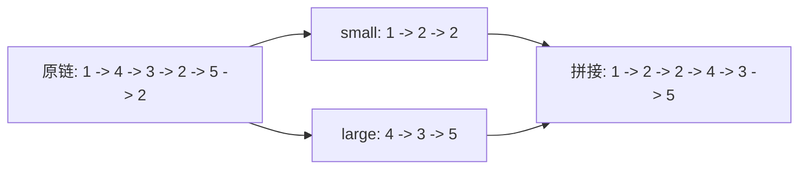

# 分割链表保持相对顺序：链表训练题解

分割链表要求所有小于 `x` 的节点排在前面，同时保持每个分区内部的原相对顺序。最直接的做法是维护两条链表。

一句话记法：**小的进 small 链，大的进 large 链，最后 small 接 large。**

## 适用场景

- 按某个条件稳定分区链表。
- 要保持原相对顺序。
- 节点可以原地重接，不需要新建节点。

如果不要求稳定顺序，可以有别的做法；但 #86 明确要求保持相对顺序。

## 图解思路



扫描原链时，每个节点只追加到其中一条链表尾部。

## 不变量

- `smallTail` 指向小于 `x` 链表的尾。
- `largeTail` 指向大于等于 `x` 链表的尾。
- 两条链表内部顺序和原链一致。
- 扫描结束后，`largeTail.Next` 必须断开，避免残留旧指针成环。

## 手写步骤

1. 建 `smallDummy` 和 `largeDummy`。
2. 遍历原链。
3. 根据节点值接到 small 或 large 尾部。
4. 推进对应尾指针。
5. 扫描结束后断开 large 尾部。
6. `smallTail.Next = largeDummy.Next`。

## Go 参考实现

```go
func partition(head *ListNode, x int) *ListNode {
	smallDummy, largeDummy := &ListNode{}, &ListNode{}
	smallTail, largeTail := smallDummy, largeDummy

	for head != nil {
		next := head.Next
		head.Next = nil
		if head.Val < x {
			smallTail.Next = head
			smallTail = smallTail.Next
		} else {
			largeTail.Next = head
			largeTail = largeTail.Next
		}
		head = next
	}

	smallTail.Next = largeDummy.Next
	return smallDummy.Next
}
```

## 为什么这样写

稳定分区不能把小节点随便插到头部，否则会反转小于 `x` 的相对顺序。维护尾指针追加，才能保证顺序稳定。

每次先保存 `next` 并断开 `head.Next`，是为了避免旧链表的尾巴继续挂在新链表后面。尤其当最后一个 large 节点原本指向某个 small 节点时，不断开可能形成错误连接。

## 复杂度

- 时间复杂度：$O(n)$。
- 空间复杂度：$O(1)$，只用了常数个指针。

## 易错点

- 用头插法收集小节点，破坏相对顺序。
- 没断开节点旧的 `Next`，导致拼接后有残留边。
- 忘记拼接 small 和 large。
- 返回 `head` 或 `smallTail`，而不是 `smallDummy.Next`。

## 练习顺序

建议先刷 #86。

做完后可以把这个思路迁移到奇偶链表、按条件拆分链表等稳定分区题。
