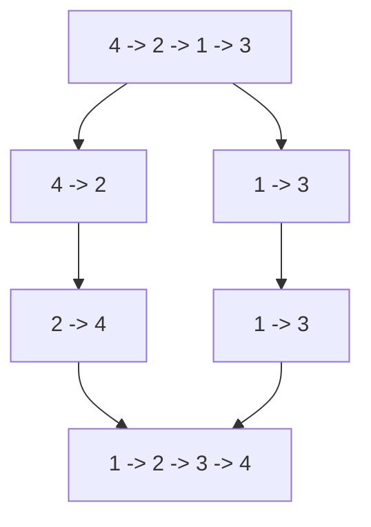

# 归并排序拆分合并：链表训练题解

链表排序用归并排序很自然，因为链表合并两个有序序列只需要改指针，不需要额外数组搬移。

一句话记法：**快慢指针切两半，递归排两边，最后有序归并。**

## 适用场景

- 排序链表，要求 $O(n \log n)$ 时间。
- 链表不能随机访问，不适合快速用数组式分区。
- 想保持较稳定的复杂度。

自顶向下归并会用递归栈；如果题目严格要求 $O(1)$ 空间，可以写自底向上归并。

## 图解思路



切分时必须断开两段，否则递归不会变短。

## 不变量

- `sortList(head)` 返回以 `head` 这段节点排序后的头。
- 每次切分后，左右两段互不相连。
- 合并阶段只接两个有序链表的头节点。
- 基准条件是空链或单节点。

## 手写步骤

1. 如果 `head == nil || head.Next == nil`，直接返回。
2. 用快慢指针找左中点。
3. `right := slow.Next`，然后 `slow.Next = nil` 断开。
4. 递归排序左右两段。
5. 合并两个有序链表。

## Go 参考实现

```go
func sortList(head *ListNode) *ListNode {
	if head == nil || head.Next == nil {
		return head
	}

	slow, fast := head, head
	for fast.Next != nil && fast.Next.Next != nil {
		slow = slow.Next
		fast = fast.Next.Next
	}
	right := slow.Next
	slow.Next = nil

	left := sortList(head)
	right = sortList(right)
	return merge(left, right)
}

func merge(a, b *ListNode) *ListNode {
	dummy := &ListNode{}
	tail := dummy
	for a != nil && b != nil {
		if a.Val <= b.Val {
			tail.Next = a
			a = a.Next
		} else {
			tail.Next = b
			b = b.Next
		}
		tail = tail.Next
	}
	if a != nil {
		tail.Next = a
	} else {
		tail.Next = b
	}
	return dummy.Next
}
```

## 为什么这样写

链表无法 $O(1)$ 访问中点，所以用快慢指针切分。切分时选择左中点，是为了长度为 2 的链表能切成 1 和 1；如果切不开，递归会无限进行。

合并过程复用“两个有序链表归并”的套路。每层总共处理所有节点一次，层数是 $\log n$，所以时间是 $O(n \log n)$。

## 复杂度

- 时间复杂度：$O(n \log n)$。
- 空间复杂度：自顶向下递归栈 $O(\log n)$。

## 易错点

- 找到中点后忘记 `slow.Next = nil`。
- 快慢指针条件写错，长度为 2 时切不短。
- 合并时忘记接剩余链表。
- 递归基准只判断 `head == nil`，单节点继续拆导致错误。

## 练习顺序

建议先刷 #148。

复盘时把 #21 的合并函数单独写熟，#148 就只剩“找中点并断链”。
