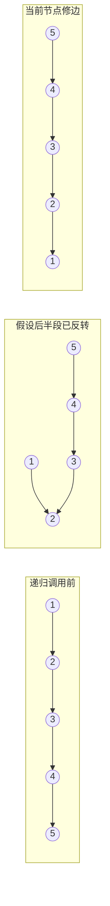
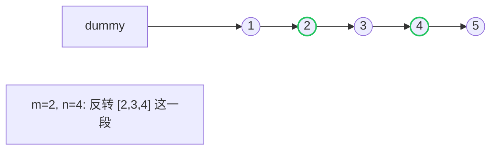

# 链表反转：迭代、递归与区间反转

## 问题抽象

> 给定一个单链表的头节点 `head`，把它**原地反转**：原来从前往后的箭头方向全部翻过来。

输入 `1 → 2 → 3 → 4 → 5 → ∅`，输出 `5 → 4 → 3 → 2 → 1 → ∅`。

## 三件事一起做

每改一条边，必须**保留**三个引用，否则就丢链：


操作顺序记成口诀：

1. `next = curr.next`        ← **先存档**
2. `curr.next = prev`        ← 翻箭头
3. `prev = curr`             ← 推进 prev
4. `curr = next`             ← 推进 curr

## 写法 A：迭代

```rust
// 节点定义
pub struct Node {
    pub val: i32,
    pub next: Option<Box<Node>>,
}

pub fn reverse(mut head: Option<Box<Node>>) -> Option<Box<Node>> {
    let mut prev: Option<Box<Node>> = None;
    while let Some(mut curr) = head {
        let next = curr.next.take();  // 1. 存档
        curr.next = prev;             // 2. 翻箭头
        prev = Some(curr);            // 3. 推进 prev
        head = next;                  // 4. 推进 curr (这里复用了 head)
    }
    prev
}
```

```go
type Node struct { Val int; Next *Node }

func reverse(head *Node) *Node {
    var prev *Node
    curr := head
    for curr != nil {
        next := curr.Next
        curr.Next = prev
        prev = curr
        curr = next
    }
    return prev
}
```

```python
class Node:
    def __init__(self, val=0, nxt=None):
        self.val, self.next = val, nxt

def reverse(head):
    prev, curr = None, head
    while curr:
        nxt = curr.next
        curr.next = prev
        prev = curr
        curr = nxt
    return prev
```

时间 $O(n)$，空间 $O(1)$。

## 写法 B：递归

递归版的关键观察：**信任递归** —— 假设 `reverse(head.next)` 已经把后半段反转好了，我们只需要处理"当前节点和它的下一个"这一对：



```rust
pub fn reverse_rec(head: Option<Box<Node>>) -> Option<Box<Node>> {
    fn helper(curr: Option<Box<Node>>, prev: Option<Box<Node>>) -> Option<Box<Node>> {
        match curr {
            None => prev,
            Some(mut node) => {
                let next = node.next.take();
                node.next = prev;
                helper(next, Some(node))
            }
        }
    }
    helper(head, None)
}
```

> Rust 的所有权让"传统递归"（指针到处指）不太自然，所以这里用尾递归式写法，把 `prev` 当累加器传下去 —— 思想是一样的。

```go
func reverseRec(head *Node) *Node {
    if head == nil || head.Next == nil {
        return head
    }
    newHead := reverseRec(head.Next)
    head.Next.Next = head    // 让后一个指回自己
    head.Next = nil          // 断掉原来的指针
    return newHead
}
```

时间 $O(n)$，空间 $O(n)$（递归栈）。

## 写法 C：区间反转 [m, n]

> 抽象问题：只反转链表中**第 m 到第 n 个节点**（1-indexed），其它部分保持原样。

技巧：用**虚拟头节点**（dummy）规避 m=1 的边界。然后定位到第 m-1 个节点 `pre`，对它后面那 `n - m + 1` 个节点做"头插"。



**头插法**：每一轮把当前节点 `curr.next` 摘下来，插到 `pre` 的正后面：

```text
pre → curr → x → y → ...
        把 x 摘掉,塞到 pre 后面：
pre → x → curr → y → ...
        再把 y 摘掉,塞到 pre 后面：
pre → y → x → curr → ...
```

```go
func reverseBetween(head *Node, m, n int) *Node {
    dummy := &Node{Next: head}
    pre := dummy
    for i := 1; i < m; i++ { pre = pre.Next }
    curr := pre.Next
    for i := 0; i < n-m; i++ {
        nxt := curr.Next      // 摘下 curr 后面的节点
        curr.Next = nxt.Next  // 让 curr 跳过它
        nxt.Next = pre.Next   // 塞到 pre 后面
        pre.Next = nxt
    }
    return dummy.Next
}
```

## 进阶：K 个一组反转

把链表每 K 个节点为一组反转，不足 K 个的尾部保持原样。

**做法**：用区间反转作为子过程，外层循环每次找一个长度为 K 的窗口。

伪代码：

```text
pre = dummy
while True:
    tail = pre 后面第 K 个节点
    if tail == null: break
    head = pre.next
    next_group = tail.next
    断开: tail.next = null
    reverse(head)
    pre.next = tail   // 反转后 tail 成了新头
    head.next = next_group
    pre = head        // 进入下一组
```

## 反转的妙用：判断回文

> 抽象问题：判断单链表是否为回文。

$O(1)$ 空间做法：

1. 用**快慢指针**找中点
2. **反转后半段**
3. 前半段与反转后的后半段逐位对比
4. 如有需要，再反转回去恢复原链

这道题把"反转中点之后"和"快慢指针"两个套路串到了一起。

## 容易踩的坑

| 坑 | 表现 | 修复 |
| --- | --- | --- |
| 没存 `next` 就改 `curr.next` | 链断了，节点丢失 | 永远先 `next = curr.next` |
| 递归版忘记 `head.next = nil` | 出现环 | `head.next.next = head` 后必须 `head.next = nil` |
| 区间反转忘记 dummy | m=1 的时候 head 变了不好返回 | 一律用 dummy，最后返回 `dummy.next` |
| 反转一半忘记接尾巴 | 链表只剩一段 | 区间反转后必须把段尾接回去 |

## 相关题目

- #206 反转链表（基础）
- #92 反转链表 II（区间反转）
- #25 K 个一组翻转链表（区间反转 + 外层切分）
- #234 回文链表（反转后半段对比）
- #24 两两交换链表中的节点（K=2 的特例）
