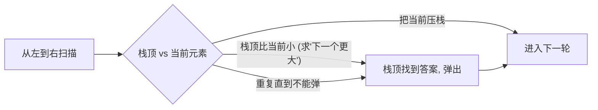

# 单调栈：求"下一个更大"和"左边第一个更小"

## 它解决什么类型的问题？

只要题面里出现下面任一关键词，先想单调栈：

- 下一个 **更大 / 更小** 的元素
- 左边 / 右边第一个 **比 x 大 / 小** 的位置
- 柱状图、雨水、贡献法
- 求"作为最大值 / 最小值的区间"



**核心不变量**：栈里的元素从底到顶**单调**（递增或递减）。当前元素一来，把"不满足单调性"的栈顶全弹出，弹出的同时就是它们的答案被定下来的时刻。

## 模板：下一个更大的元素

> 抽象问题：给定数组 `nums`，为每个元素求其右侧第一个比它大的元素；不存在则填 -1。

栈中存"还没找到下一个更大值的下标"，**栈底到栈顶单调递减**。

```rust
fn next_greater(nums: Vec<i32>) -> Vec<i32> {
    let n = nums.len();
    let mut ans = vec![-1; n];
    let mut stk: Vec<usize> = Vec::new();           // 存下标
    for i in 0..n {
        while let Some(&top) = stk.last() {
            if nums[top] < nums[i] {
                ans[top] = nums[i];
                stk.pop();
            } else { break; }
        }
        stk.push(i);
    }
    ans
}
```

为什么是 O(n)？每个下标最多 push 一次、pop 一次，总操作数 ≤ 2n。

### 四种变体一张表

| 题型 | 栈内单调性 | 弹栈条件 |
| --- | --- | --- |
| 右边第一个**更大** | 递减 | `nums[top] < nums[i]` |
| 右边第一个**更小** | 递增 | `nums[top] > nums[i]` |
| 左边第一个**更大** | 递减、从右往左扫 | 同上反过来 |
| 左边第一个**更小** | 递增、从右往左扫 | 同上反过来 |

记忆口诀：**想找"更大"，栈就单调递减**（这样栈顶最小，最容易被新来的更大值"踹下去"）。反之亦然。

## 循环数组怎么办？

> 抽象问题：每个元素的下一个更大元素，数组**循环**。

技巧：**把数组拼接两遍**，索引取模。或者直接遍历 `2n` 圈而下标 `i % n`：

```rust
fn next_greater_circular(nums: Vec<i32>) -> Vec<i32> {
    let n = nums.len();
    let mut ans = vec![-1; n];
    let mut stk: Vec<usize> = Vec::new();
    for i in 0..2 * n {
        let cur = nums[i % n];
        while let Some(&top) = stk.last() {
            if nums[top] < cur {
                ans[top] = cur;
                stk.pop();
            } else { break; }
        }
        if i < n { stk.push(i); }                    // 第二圈只用来弹, 不压入
    }
    ans
}
```

## 例：柱状图中最大的矩形

> 抽象问题：给定一组非负整数代表柱状图的柱子高度，求其中能勾勒出的最大矩形面积。

**关键转换**：枚举每根柱子 `i` 作为最矮的那根，向左右扩展找到第一个比它矮的柱子 `L` 和 `R`。那么以 `i` 为最矮的最大矩形宽度就是 `R - L - 1`，面积 `heights[i] * (R - L - 1)`。

这正好是"左/右第一个更小"——两次单调栈搞定。一个更简洁的写法是**一次扫描**，在哨兵的帮助下同时处理左右边界：

```rust
fn largest_rectangle_area(mut heights: Vec<i32>) -> i32 {
    heights.push(0);                                 // 哨兵: 强迫栈最后清空
    let mut stk: Vec<usize> = Vec::new();
    let mut best = 0;
    for i in 0..heights.len() {
        while let Some(&top) = stk.last() {
            if heights[top] > heights[i] {
                stk.pop();
                let h = heights[top];
                let l = stk.last().map(|&x| x as i32).unwrap_or(-1);
                let w = i as i32 - l - 1;
                best = best.max(h * w);
            } else { break; }
        }
        stk.push(i);
    }
    best
}
```

哨兵的作用：原数组末尾追加一个 0，保证扫描结束时栈一定会被清空，所有未结算的柱子都能拿到右边界。

## 例：接雨水

> 抽象问题：用非负整数表示柱子高度，下雨后柱子之间能接多少单位的雨水？

单调栈做法：维护一个**递减栈**。当前柱子比栈顶高时，栈顶就是"凹槽底"，弹出它后栈里新的栈顶是"左墙"，当前位置是"右墙"，那一层雨水就被算出来了。

```rust
fn trap(height: Vec<i32>) -> i32 {
    let mut stk: Vec<usize> = Vec::new();
    let mut sum = 0i32;
    for i in 0..height.len() {
        while let Some(&top) = stk.last() {
            if height[top] < height[i] {
                stk.pop();
                if let Some(&left) = stk.last() {
                    let h = height[i].min(height[left]) - height[top];
                    let w = (i - left - 1) as i32;
                    sum += h * w;
                }
            } else { break; }
        }
        stk.push(i);
    }
    sum
}
```

也可以用"双指针 + 左右最大值"做到 O(1) 空间。但单调栈胜在思路统一：和柱状图最大矩形几乎是同一个模板。

## 进阶套路：贡献法

很多"区间最值的总和 / 计数"题，可以用**单调栈算每个元素的贡献区间**：

> 抽象问题：求所有子数组的最小值之和。

对每个 `nums[i]`，找它作为最小值的最远左端点 `L[i]` 和最远右端点 `R[i]`。它对答案的贡献就是 `nums[i] * (i - L[i]) * (R[i] - i)`。

`L[i]` = 左边第一个比它**严格小**的下标 + 1，`R[i]` = 右边第一个比它**严格小或相等**的下标 - 1。注意一个边严格、一个边非严格，避免重复计数。

## 常见坑速查

| 坑 | 修复 |
| --- | --- |
| 栈里到底存值还是下标 | 一律存下标，需要值再 `nums[idx]` 查 |
| 单调性写反、栈一直变长 | 列一个小用例手动模拟一遍 |
| 哨兵忘加 → 末尾元素没结算 | 数组末尾追加 0 / `i32::MIN` 之类 |
| 相等元素重复计数（贡献法） | 一边严格、一边非严格 |
| 循环数组没遍历 2n 圈 | `for i in 0..2*n` + 取模 |

## 相关题目

- #496 下一个更大元素 I（模板题）
- #503 下一个更大元素 II（循环数组）
- #739 每日温度（下一个更大的"距离"）
- #84 柱状图中最大的矩形
- #42 接雨水（递减栈或双指针）
- #901 股票价格跨度
- #316 去除重复字母（单调栈 + 贪心）
- #402 移掉 K 位数字（单调栈 + 贪心）
