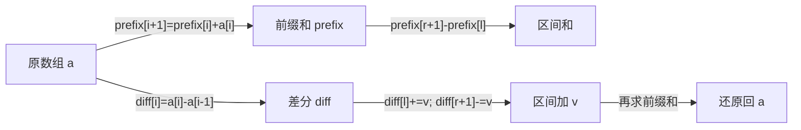
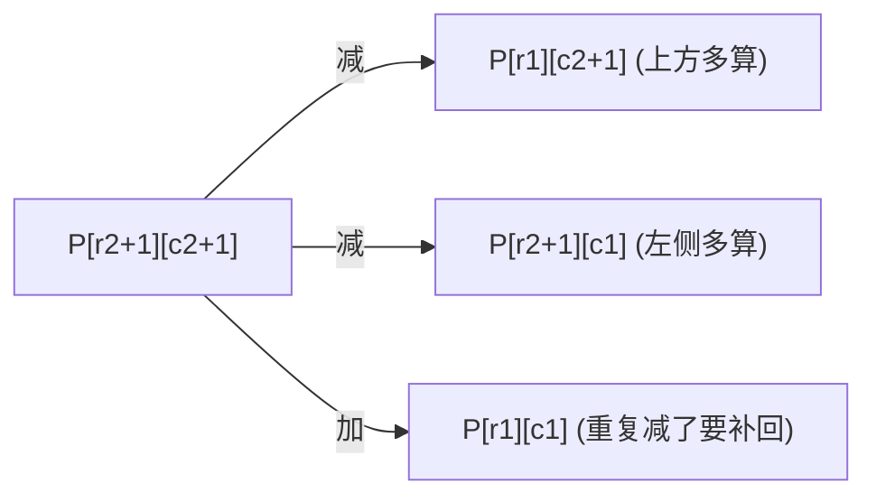

# 前缀和与差分：一次预处理，把区间操作变 O(1)

前缀和与差分是一对**互逆操作**。在掌握后，你看到下面这两种题型可以直接条件反射：

- "**多次查询区间和**" → 前缀和。
- "**多次区间整体加减，最后看每个位置的值**" → 差分。



## 一维前缀和

> 抽象问题：给定数组 `nums`，多次询问区间 `[l, r]` 的和，要求每次询问 O(1)。

定义 `prefix[i] = nums[0] + nums[1] + ... + nums[i-1]`，规定 `prefix[0] = 0`。

那么 `sum(l..=r) = prefix[r+1] - prefix[l]`。

```rust
struct NumArray {
    prefix: Vec<i64>,
}

impl NumArray {
    fn new(nums: Vec<i32>) -> Self {
        let mut prefix = vec![0i64; nums.len() + 1];
        for (i, &x) in nums.iter().enumerate() {
            prefix[i + 1] = prefix[i] + x as i64;
        }
        Self { prefix }
    }

    fn sum_range(&self, l: i32, r: i32) -> i32 {
        (self.prefix[r as usize + 1] - self.prefix[l as usize]) as i32
    }
}
```

**关键技巧**：让 `prefix` 多开一格、首位置 0。这样所有区间公式都不用特判 `l == 0`。

## 二维前缀和

> 抽象问题：在矩阵 `mat` 上多次询问子矩阵 `(r1, c1)` 到 `(r2, c2)` 的和。

容斥一下：`S = P[r2+1][c2+1] - P[r1][c2+1] - P[r2+1][c1] + P[r1][c1]`。



```rust
fn build_2d_prefix(mat: &Vec<Vec<i32>>) -> Vec<Vec<i64>> {
    let m = mat.len();
    let n = if m == 0 { 0 } else { mat[0].len() };
    let mut p = vec![vec![0i64; n + 1]; m + 1];
    for i in 0..m {
        for j in 0..n {
            p[i + 1][j + 1] = p[i][j + 1] + p[i + 1][j] - p[i][j] + mat[i][j] as i64;
        }
    }
    p
}
```

## "前缀和 + 哈希表"组合拳

更常见的是：**遇到"和为 k 的子数组个数"，要立刻想到前缀和 + 哈希。**

> 抽象问题：求数组中和为 `k` 的连续子数组个数。

枚举右端点 `j`，左端点贡献来自 `prefix[i] == prefix[j+1] - k`。用哈希表统计每个前缀和出现的次数即可：

```rust
use std::collections::HashMap;

fn subarray_sum(nums: Vec<i32>, k: i32) -> i32 {
    let mut count: HashMap<i64, i32> = HashMap::new();
    count.insert(0, 1);                         // 空前缀
    let (mut acc, mut ans) = (0i64, 0);
    for x in nums {
        acc += x as i64;
        if let Some(&c) = count.get(&(acc - k as i64)) {
            ans += c;
        }
        *count.entry(acc).or_insert(0) += 1;
    }
    ans
}
```

变体很多，但套路一致：

- **和能被 K 整除的子数组**：把 `acc` 换成 `acc % k`，注意负数取模。
- **连续子数组的最大长度 = k**：哈希存"第一次出现的下标"，求 `j - i` 的最大值。
- **元素 0/1 数量相等**：把 0 当 -1，问题变成"和为 0 的子数组"。

## 一维差分

> 抽象问题：原数组初始全 0，多次操作"把 `[l, r]` 区间整体加 `v`"，最后输出整个数组。

差分定义：`diff[i] = a[i] - a[i-1]`（`diff[0] = a[0]`）。

把 `[l, r]` 加 `v` 等价于：

```text
diff[l]   += v
diff[r+1] -= v       // 注意可能越界,要多开一格
```

最后**对 `diff` 做一次前缀和**就还原回了 `a`。

```rust
fn apply_range_updates(n: usize, ops: &[(usize, usize, i32)]) -> Vec<i32> {
    let mut diff = vec![0i32; n + 1];          // 多开 1 格防越界
    for &(l, r, v) in ops {
        diff[l] += v;
        diff[r + 1] -= v;
    }
    let mut a = vec![0i32; n];
    let mut acc = 0;
    for i in 0..n {
        acc += diff[i];
        a[i] = acc;
    }
    a
}
```

复杂度从"每次 O(r - l)"降到了"每次 O(1)，最后一次 O(n)"。

### 例：航班预订统计

> 抽象问题：`bookings[i] = [first, last, seats]` 表示从航班 `first` 到 `last` 每个航班加 `seats` 个预订，求每个航班的总预订数。

直接套差分模板：

```python
def corp_flight_bookings(bookings, n):
    diff = [0] * (n + 1)
    for first, last, seats in bookings:
        diff[first - 1] += seats          # 题目下标从 1 开始
        diff[last]     -= seats
    out = [0] * n
    acc = 0
    for i in range(n):
        acc += diff[i]
        out[i] = acc
    return out
```

## 二维差分

二维差分是二维前缀和的逆。把矩形 `(r1, c1)` 到 `(r2, c2)` 整体加 `v`：

```text
diff[r1][c1]     += v
diff[r1][c2+1]   -= v
diff[r2+1][c1]   -= v
diff[r2+1][c2+1] += v
```

最后用二维前缀和扫一遍还原。"会议室扎堆"、"地图加热值"这类题就是这个套路。

## 用哪一个，看动作方向

| 题目特征 | 用哪个 |
| --- | --- |
| 多次**询问**区间和（数组不变） | 前缀和 |
| 多次**修改**区间整体加减，最后一次查询 | 差分 |
| 多次修改 + 多次询问 | 树状数组 / 线段树（不是这两位的活了） |
| 子数组和等于某值 / 整除某值 | 前缀和 + 哈希表 |

## 常见坑速查

| 坑 | 修复 |
| --- | --- |
| `prefix[l]` 没多开 1 格，要特判 `l==0` | 永远让 prefix 长度 = n + 1，首位 0 |
| 差分 `diff[r+1]` 越界 | diff 数组多开一格 |
| 负数前缀和取模出负 | `(acc % k + k) % k` |
| 二维容斥符号写反 | 画一张 2×2 的小图自己推一遍 |
| 把"子数组"和"子序列"搞混 | 前缀和只能处理**连续**子数组 |

## 相关题目

- #303 区域和检索 - 数组不可变（一维前缀和模板）
- #304 二维区域和检索（二维前缀和）
- #560 和为 K 的子数组（前缀和 + 哈希）
- #974 和可被 K 整除的子数组
- #525 连续数组（0/1 转换 + 前缀和）
- #238 除自身以外数组的乘积（前缀积 / 后缀积）
- #1109 航班预订统计（一维差分）
- #1094 拼车（一维差分）
