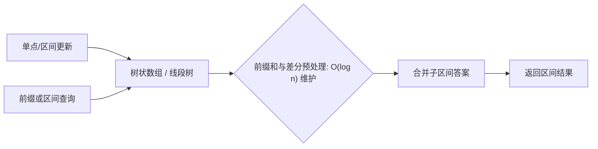

# 前缀和与差分预处理：区间查询训练题解

这篇不是背模板，而是把 **前缀和与差分预处理** 拆成可以手写、可以检查的步骤。训练时建议先遮住题解，只看图和不变量，自己写一版，再展开代码对照。

## 适用场景

频繁单点更新又要区间聚合时，用树状数组或线段树把每次操作压到对数级。

- 出现“频繁单点更新 + 区间查询（和 / 最值 / 计数）”，朴素前缀和每次更新退化成 $O(n)$，改用树状数组或线段树。
- 先确定维护的是和、最值还是计数，再决定结构与是否需要懒标记。

## 图解思路



按这张图写代码时，先不要急着写完整函数，先把图里的三个变量写出来：

- `tree`：每个节点维护一段区间的聚合值。
- `lowbit / 区间端点`：决定更新和查询要跳过哪些区间。
- `lazy`：区间更新时挂起、查询时下传的标记。

## 手写步骤

1. 想清楚维护的聚合是和 / 最值 / 计数。
2. 树状数组写 update 与 query，循环按 `i += i & -i` / `i -= i & -i` 跳。
3. 需要区间更新就上线段树 + 懒标记，pushdown 再递归。
4. 值域大时先离散化再建树。

## Go 参考骨架

```go
// 树状数组：单点加 + 前缀和查询；区间和 = Query(r) - Query(l-1)
type BIT struct{ tree []int }

func NewBIT(n int) *BIT { return &BIT{tree: make([]int, n+1)} }

func (b *BIT) Update(i, delta int) {
	for ; i < len(b.tree); i += i & -i {
		b.tree[i] += delta
	}
}

func (b *BIT) Query(i int) int {
	sum := 0
	for ; i > 0; i -= i & -i {
		sum += b.tree[i]
	}
	return sum
}
```

## Rust 参考骨架

```rust
// 树状数组：单点加 + 前缀和查询
pub struct Bit {
    tree: Vec<i64>,
}

impl Bit {
    pub fn new(n: usize) -> Self {
        Self { tree: vec![0; n + 1] }
    }

    pub fn update(&mut self, mut i: usize, delta: i64) {
        while i < self.tree.len() {
            self.tree[i] += delta;
            i += i & i.wrapping_neg();
        }
    }

    pub fn query(&self, mut i: usize) -> i64 {
        let mut sum = 0;
        while i > 0 {
            sum += self.tree[i];
            i -= i & i.wrapping_neg();
        }
        sum
    }
}
```

## 为什么这样写

树状数组和线段树把“前缀聚合 + 单点修改”都压到 $O(\log n)$，逆序对、区间和、区间最值因此从 $O(n^2)$ 降到 $O(n\log n)$。

## 复杂度

- 时间复杂度：单次更新 / 查询 $O(\log n)$，整体 $O(n\log n)$。
- 空间复杂度：$O(n)$，动态开点线段树 $O(q\log n)$。

## 易错点

- 树状数组下标从 1 开始，写成 0 会死循环。
- 区间更新忘了下传懒标记，查询读到旧值。
- 离散化后用错原值，应该用排名。

## 练习顺序

建议按这个顺序刷：#1094, #2406, #307, #308, #315, #327。每题都先写 Go 或 Rust，再对照题解。
