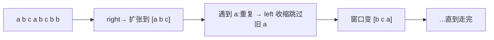
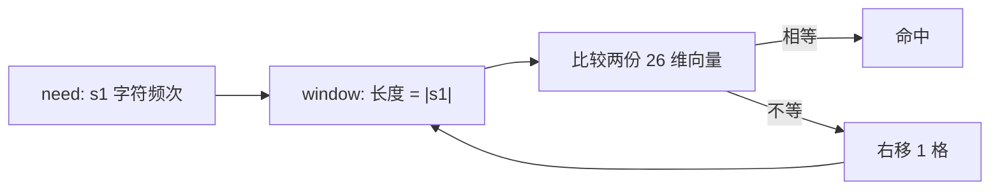

# 滑动窗口：从暴力枚举到线性扫描

## 何时用滑动窗口

满足下面三个条件同时具备，就该考虑滑动窗口：

1. 处理对象是**连续的**子数组或子串（不能跳跃选）
2. 需要在窗口上维护某种**可增量更新**的统计量（元素出现次数、和、最值 ...）
3. 当窗口扩张到不满足条件时，能通过**收缩左端**重新满足

如果窗口扩张/收缩**单调推进**（左右指针都只往右走），时间复杂度就是 $O(n)$。

## 通用框架

```text
left = 0
window = 空容器
for right in 0..n:
    window 加入 s[right]                  // 扩张
    while 窗口不满足约束:
        window 移除 s[left]               // 收缩
        left += 1
    更新答案                              // 用 [left..=right] 这个窗口
```

注意"更新答案"的位置：

- 求**最长**：在 while 外面（保证此时窗口是合法的最大）
- 求**最短**：在 while 里面（缩到刚不合法之前的一刻）
- **计数**类（多少个合法子串）：在 while 外面累加 `right - left + 1`

## 例 1：无重复字符的最长子串

> 抽象问题：给定字符串 `s`，找出**不含重复字符**的最长子串的长度。

**窗口约束**：窗口内每个字符出现次数 ≤ 1。
**统计量**：哈希计数。



```rust
use std::collections::HashMap;

fn length_of_longest_substring(s: &str) -> i32 {
    let bytes = s.as_bytes();
    let mut count: HashMap<u8, usize> = HashMap::new();
    let (mut left, mut ans) = (0usize, 0usize);
    for (right, &ch) in bytes.iter().enumerate() {
        *count.entry(ch).or_insert(0) += 1;
        while count[&ch] > 1 {
            let lc = bytes[left];
            *count.get_mut(&lc).unwrap() -= 1;
            left += 1;
        }
        ans = ans.max(right - left + 1);
    }
    ans as i32
}
```

```python
def length_of_longest_substring(s: str) -> int:
    from collections import Counter
    count = Counter()
    left = ans = 0
    for right, ch in enumerate(s):
        count[ch] += 1
        while count[ch] > 1:
            count[s[left]] -= 1
            left += 1
        ans = max(ans, right - left + 1)
    return ans
```

## 例 2：长度最小的子数组（求"最短"）

> 抽象问题：给定**正整数**数组和目标 `target`，找出和 $\ge$ target 的**最短**连续子数组长度，找不到返回 0。

注意"更新答案"的位置移到 while 里面 —— 我们要在窗口**仍然合法**的最后一刻记录长度。

```rust
fn min_subarray_len(target: i32, nums: &[i32]) -> i32 {
    let (mut left, mut sum, mut ans) = (0usize, 0i32, i32::MAX);
    for right in 0..nums.len() {
        sum += nums[right];
        while sum >= target {
            ans = ans.min((right - left + 1) as i32);
            sum -= nums[left];
            left += 1;
        }
    }
    if ans == i32::MAX { 0 } else { ans }
}
```

为什么这道题里数组必须是正整数？因为正数保证"扩张窗口和单调增、收缩窗口和单调减"，否则窗口边界推进不再单调，需要换算法（前缀和 + 单调队列，或两端 BFS）。

## 例 3：字符串的排列（定长窗口）

> 抽象问题：给定字符串 `s1` 和 `s2`，判断 `s2` 是否包含 `s1` 的某个**排列**作为子串。

这是一个**定长窗口**：窗口长度固定为 `s1.len()`，每次右移一格、左缩一格。



```rust
fn check_inclusion(s1: &str, s2: &str) -> bool {
    if s1.len() > s2.len() { return false; }
    let (a, b) = (s1.as_bytes(), s2.as_bytes());
    let mut need = [0i32; 26];
    let mut have = [0i32; 26];
    for &c in a { need[(c - b'a') as usize] += 1; }
    for i in 0..b.len() {
        have[(b[i] - b'a') as usize] += 1;
        if i >= a.len() {
            have[(b[i - a.len()] - b'a') as usize] -= 1;
        }
        if have == need { return true; }
    }
    false
}
```

## 滑动窗口 vs 暴力枚举

| 维度 | 暴力枚举 | 滑动窗口 |
| --- | --- | --- |
| 时间 | $O(n^2)$ 或 $O(n^3)$ | $O(n)$ |
| 空间 | $O(1)$ 或哈希 | 通常 $O(\Sigma)$（字符集） |
| 思维 | 每个区间从头算 | 增量维护，去掉离开窗口的影响 |

## 调试小贴士

1. **先想清楚约束什么时候被破坏** —— 这决定 while 收缩条件。
2. **答案更新位置写错是最常见 bug** —— 求最长 / 最短 / 计数三种位置不一样。
3. **窗口数据结构选错** —— 字符集小用数组，否则用 HashMap。
4. **不要忘记"刚加入"和"刚移出"两次更新** —— 计数器一加一减必须配对。

## 相关题目

- #3 无重复字符的最长子串（求最长）
- #76 最小覆盖子串（求最短 + 覆盖判定）
- #209 长度最小的子数组（求最短）
- #438 找到字符串中所有字母异位词（定长窗口）
- #567 字符串的排列（定长窗口）
- #424 替换后的最长重复字符（不变量是"最多换 k 个"）
- #1004 最大连续 1 的个数 III（"最多 k 个 0"是滑动窗口的经典伪装）
