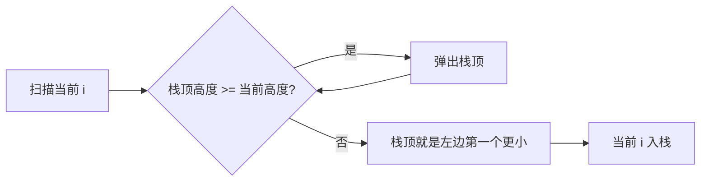

# 单调递增栈找左边界：栈与队列训练题解

单调递增栈的核心不是“栈里递增”这句话，而是它能快速回答：当前元素左边第一个比它小的位置在哪里。

一句话记法：**弹掉所有不可能当边界的高柱，剩下的栈顶就是左边第一个更小。**

## 适用场景

- 找左边第一个更小元素。
- 柱状图最大矩形。
- 子数组最小值贡献。
- 需要知道某个元素作为最小值能向左扩多远。

栈里通常存下标，不直接存值，因为下标能同时拿到值和距离。

## 图解思路



弹出的元素比当前高或相等，它们不可能再作为当前或后续某些元素的“更小左边界”。

## 不变量

- 栈内下标对应的值从底到顶递增。
- 栈顶是离当前最近、且值更小的候选边界。
- 当前元素处理完后要入栈，给后续元素当候选边界。
- 相等值是否弹出，取决于题目是否要避免重复贡献。

## 手写步骤

1. 初始化空栈。
2. 从左到右扫描。
3. 当栈顶不满足递增关系时弹出。
4. 弹完后，栈顶就是左边界；栈空则没有左边界。
5. 当前下标入栈。

## Go 参考实现：左边第一个更小下标

```go
func prevLess(nums []int) []int {
	ans := make([]int, len(nums))
	st := []int{}
	for i, x := range nums {
		for len(st) > 0 && nums[st[len(st)-1]] >= x {
			st = st[:len(st)-1]
		}
		if len(st) == 0 {
			ans[i] = -1
		} else {
			ans[i] = st[len(st)-1]
		}
		st = append(st, i)
	}
	return ans
}
```

## 为什么这样写

假设栈顶 `j` 的值 `nums[j] >= nums[i]`。对后面的元素来说，`j` 比 `i` 更靠左且值不更小；如果要找更小边界，`j` 永远不会比 `i` 更优，所以可以弹掉。

这就是单调栈的摊还复杂度来源：每个下标最多入栈一次、出栈一次。

## 复杂度

- 时间复杂度：$O(n)$。
- 空间复杂度：$O(n)$。

## 易错点

- 栈里存值，后面需要距离时拿不到下标。
- 相等元素弹不弹没有想清楚，贡献法会重复计数。
- 弹完后没判断栈空。
- 以为 while 可以换成 if；连续多个不合法栈顶都要弹。

## 练习顺序

建议按这个顺序刷：#84, #907。

先用柱状图理解左右边界，再做贡献法，重点练相等元素的严格/非严格处理。
