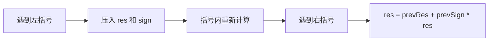

# 表达式遇右括号结算：栈与队列训练题解

基础计算器这类题，括号表示“先算一段子表达式”。遇到左括号时保存外层状态，遇到右括号时把括号内结果合并回外层。

一句话记法：**左括号压当前结果和符号，右括号弹出来合并。**

## 适用场景

- 表达式只有 `+`、`-` 和括号。
- 需要处理多位数字和空格。
- 括号可以嵌套。

如果包含 `*`、`/`，通常还要用栈处理运算优先级，不能只靠当前结果和符号。

## 图解思路



栈保存的是进入括号前的上下文。

## 不变量

- `res` 是当前层已经计算出的结果。
- `sign` 是下一个数字或括号结果前面的符号。
- 栈中按顺序保存外层的 `res` 和 `sign`。
- 右括号结算后，当前层结果变成外层的一部分。

## Go 参考实现

```go
func calculate(s string) int {
	res, sign, num := 0, 1, 0
	st := []int{}

	for i := 0; i < len(s); i++ {
		ch := s[i]
		if ch >= '0' && ch <= '9' {
			num = num*10 + int(ch-'0')
		} else if ch == '+' || ch == '-' {
			res += sign * num
			num = 0
			if ch == '+' {
				sign = 1
			} else {
				sign = -1
			}
		} else if ch == '(' {
			st = append(st, res, sign)
			res, sign = 0, 1
		} else if ch == ')' {
			res += sign * num
			num = 0
			prevSign := st[len(st)-1]
			prevRes := st[len(st)-2]
			st = st[:len(st)-2]
			res = prevRes + prevSign*res
		}
	}
	return res + sign*num
}
```

## 为什么这样写

表达式 `1-(2+3)` 中，进入括号前外层状态是 `res=1, sign=-1`。括号内算出 `5` 后，最终应该是 `1 + (-1)*5`。所以左括号时压入外层状态，右括号时合并。

多位数字要持续累积到遇到运算符或右括号时才结算。遍历结束后还要把最后一个数字结算进结果。

## 复杂度

- 时间复杂度：$O(n)$。
- 空间复杂度：$O(n)$，取决于括号嵌套深度。

## 易错点

- 遇到左括号时没有重置 `res` 和 `sign`。
- 右括号前忘记先把括号内最后一个数字加入 `res`。
- 栈中 `res` 和 `sign` 弹出顺序弄反。
- 遍历结束忘记结算最后一个 `num`。

## 练习顺序

建议按这个顺序刷：#224, #227, #772。

先处理只有加减和括号，再加入乘除优先级，最后处理完整嵌套表达式。
