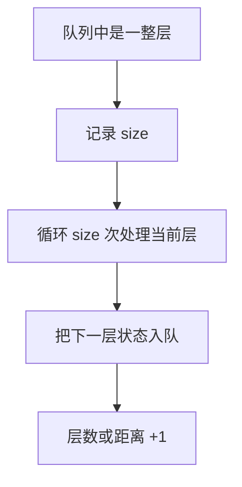

# 队列模拟层序状态：栈与队列训练题解

BFS 的队列保存“已经发现但还没处理”的状态。按层处理时，关键是每轮先固定当前层的节点数量。

一句话记法：**入队的是下一层，出队的是当前层；层大小要先记下来。**

## 适用场景

- 二叉树层序遍历。
- 网格最短步数。
- 多源 BFS 扩散。
- 要按层统计答案，比如腐烂橘子分钟数。

DFS 能遍历，但涉及最短步数或按层扩散时，BFS 更直接。

## 图解思路



如果不先记录 `size`，循环中入队的新节点会混进当前层。

## 不变量

- 每轮开始时，队列里正好是当前层所有节点。
- 本轮循环只处理初始 `size` 个状态。
- 新入队状态属于下一层。
- 每处理完一轮，距离或层数增加一次。

## Go 参考实现：二叉树层序遍历

```go
func levelOrder(root *TreeNode) [][]int {
	if root == nil {
		return nil
	}
	q := []*TreeNode{root}
	ans := [][]int{}
	for len(q) > 0 {
		size := len(q)
		level := make([]int, 0, size)
		for i := 0; i < size; i++ {
			node := q[0]
			q = q[1:]
			level = append(level, node.Val)
			if node.Left != nil {
				q = append(q, node.Left)
			}
			if node.Right != nil {
				q = append(q, node.Right)
			}
		}
		ans = append(ans, level)
	}
	return ans
}
```

## 为什么这样写

BFS 天然按距离从近到远处理。队列先进先出，保证先发现的状态先处理；按层固定 `size`，保证本轮只处理当前距离的状态。

多源 BFS 只是初始队列里放多个源点，后续逻辑完全一样。

## 复杂度

- 时间复杂度：$O(n)$。
- 空间复杂度：$O(w)$，`w` 是最大层宽；最坏 $O(n)$。

## 易错点

- `for i := 0; i < len(q); i++`，循环条件动态变化，把下一层混进当前层。
- 忘记标记访问，网格 BFS 中重复入队。
- 层数增加位置错误，多算或少算一轮。
- 用切片 `q = q[1:]` 在工程长队列中可能保留底层数组，性能敏感时用头指针。

## 练习顺序

建议按这个顺序刷：#102, #199, #994。

先练普通层序，再练按层取右视图，最后做多源 BFS。
