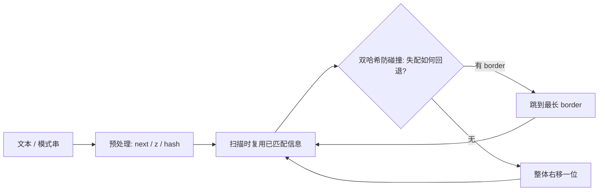

# 双哈希防碰撞：字符串匹配训练题解

这篇不是背模板，而是把 **双哈希防碰撞** 拆成可以手写、可以检查的步骤。训练时建议先遮住题解，只看图和不变量，自己写一版，再展开代码对照。

## 适用场景

失配时利用已经匹配的前缀，避免从头重来，把匹配从 O(nm) 降到线性。

- 看到“子串出现、最长回文、循环节、重复子串”，先想能不能用前缀函数 / Z 函数 / 哈希避免 $O(nm)$ 暴力。
- 核心是失配时复用已经匹配的前缀，不从头再来。

## 图解思路



按这张图写代码时，先不要急着写完整函数，先把图里的三个变量写出来：

- `next / z`：每个位置的最长 border 或扩展长度。
- `j`：模式串当前已匹配的长度。
- `hash`：子串签名，支持 $O(1)$ 比较。

## 手写步骤

1. 先 $O(n)$ 预处理 next（前缀函数）或 z 数组。
2. 主串扫描失配就用 `j = next[j-1]` 回退，不动主串指针。
3. 回文 / 循环节问题套用同一套 border 性质。
4. 任意子串比较改用滚动哈希，注意双哈希防碰撞。

## Go 参考骨架

```go
// KMP：前缀函数 + 匹配，返回 pat 在 text 中首次出现下标，没有则 -1
func kmpSearch(text, pat string) int {
	next := make([]int, len(pat))
	for i, j := 1, 0; i < len(pat); i++ {
		for j > 0 && pat[i] != pat[j] {
			j = next[j-1]
		}
		if pat[i] == pat[j] {
			j++
		}
		next[i] = j
	}
	for i, j := 0, 0; i < len(text); i++ {
		for j > 0 && text[i] != pat[j] {
			j = next[j-1]
		}
		if text[i] == pat[j] {
			j++
		}
		if j == len(pat) {
			return i - j + 1
		}
	}
	return -1
}
```

## Rust 参考骨架

```rust
// KMP：前缀函数 + 匹配，返回首次出现下标，没有则 -1
pub fn kmp_search(text: &[u8], pat: &[u8]) -> i32 {
    if pat.is_empty() {
        return 0;
    }
    let mut next = vec![0usize; pat.len()];
    let mut j = 0;
    for i in 1..pat.len() {
        while j > 0 && pat[i] != pat[j] {
            j = next[j - 1];
        }
        if pat[i] == pat[j] {
            j += 1;
        }
        next[i] = j;
    }
    j = 0;
    for (i, &c) in text.iter().enumerate() {
        while j > 0 && c != pat[j] {
            j = next[j - 1];
        }
        if c == pat[j] {
            j += 1;
        }
        if j == pat.len() {
            return (i - j + 1) as i32;
        }
    }
    -1
}
```

## 为什么这样写

前缀函数让每个主串字符最多被比较常数次，匹配从 $O(nm)$ 降到 $O(n+m)$；哈希则把任意子串比较降到均摊 $O(1)$。

## 复杂度

- 时间复杂度：KMP / Z $O(n+m)$；哈希预处理 $O(n)$、单次比较 $O(1)$。
- 空间复杂度：$O(n)$。

## 易错点

- next 回退写成 `j = next[j]` 而不是 `next[j-1]`，错位。
- 单哈希被构造数据卡碰撞，应双模数。
- 回文中心扩展忘了奇偶两种中心。

## 练习顺序

建议按这个顺序刷：#796, #1392, #187, #1044, #3008, #1316。每题都先写 Go 或 Rust，再对照题解。
