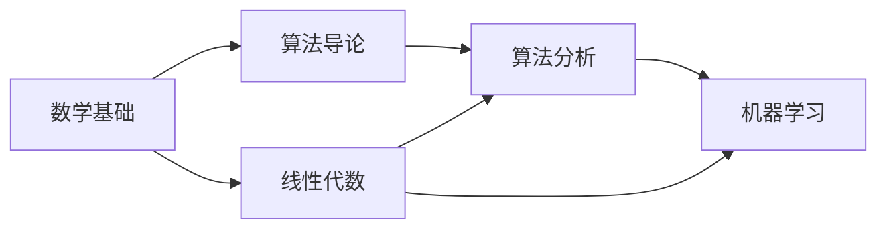
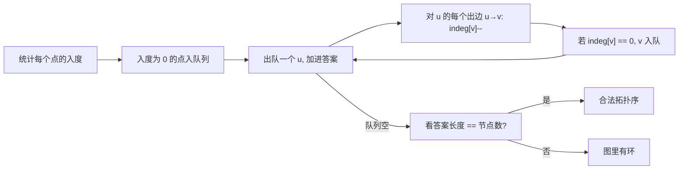

# 拓扑排序：依赖图上的线性化

## 它解决什么问题？

输入是一张**有向无环图**（DAG），每条边 `u → v` 表示"做 u 之前必须先做 v"或者"v 是 u 的依赖"。拓扑排序就是给出一个节点序列，使得对每条边，起点都排在终点前面。

典型场景：

- **课程表**：选某课前必须先修先修课。
- **构建系统**：编译某文件前必须先编译它依赖的头文件。
- **数据库迁移**：依赖表先建。
- **跨语言字典序**：从词条对推导出字符的偏序。



合法的拓扑序之一：数学基础 → 算法导论 → 线性代数 → 算法分析 → 机器学习。

## 关键判断：有环吗？

**有环就没有拓扑序**。所以拓扑排序的两个产出：

1. 一个合法的线性序（如果存在）。
2. 这张图是否是 DAG（顺手得到）。

## 方法一：BFS / Kahn 算法（入度法）

思路：



```rust
use std::collections::VecDeque;

fn topo_sort(n: usize, edges: &[(usize, usize)]) -> Option<Vec<usize>> {
    let mut graph: Vec<Vec<usize>> = vec![vec![]; n];
    let mut indeg = vec![0i32; n];
    for &(u, v) in edges {                        // u → v
        graph[u].push(v);
        indeg[v] += 1;
    }
    let mut q: VecDeque<usize> = (0..n).filter(|&i| indeg[i] == 0).collect();
    let mut order = Vec::with_capacity(n);
    while let Some(u) = q.pop_front() {
        order.push(u);
        for &v in &graph[u] {
            indeg[v] -= 1;
            if indeg[v] == 0 { q.push_back(v); }
        }
    }
    if order.len() == n { Some(order) } else { None }
}
```

**复杂度**：O(V + E)。

Kahn 的两个工程优点：

1. **天然增量**：图变化（加边）时容易增量更新入度。
2. **可控顺序**：如果题目要求"字典序最小的拓扑序"，把 `VecDeque` 换成**小根堆**即可。

## 方法二：DFS 后序

思路：从任意未访问点出发 DFS，**回溯时**把节点压栈，最后反转就是拓扑序。

```python
def topo_sort_dfs(n, edges):
    graph = [[] for _ in range(n)]
    for u, v in edges:
        graph[u].append(v)
    color = [0] * n                              # 0 未访问, 1 在栈中, 2 已完成
    order = []
    has_cycle = False

    def dfs(u):
        nonlocal has_cycle
        color[u] = 1
        for v in graph[u]:
            if color[v] == 1:
                has_cycle = True                 # 后向边 = 环
            elif color[v] == 0:
                dfs(v)
        color[u] = 2
        order.append(u)

    for i in range(n):
        if color[i] == 0:
            dfs(i)
    if has_cycle: return None
    return order[::-1]
```

DFS 三色标记：

- **0 白**：从未访问。
- **1 灰**：当前递归栈里（处理中）。
- **2 黑**：已经处理完。

遇到 `color == 1` 的邻居，说明出现了**后向边**——有环。

## 例：课程表（判环）

> 抽象问题：`prerequisites[i] = [a, b]` 表示选 a 前必须先选 b。判断能否上完所有课。

直接套 Kahn，看产出长度是否等于课程数：

```rust
fn can_finish(num_courses: i32, prerequisites: Vec<Vec<i32>>) -> bool {
    let n = num_courses as usize;
    let edges: Vec<(usize, usize)> = prerequisites
        .into_iter()
        .map(|p| (p[1] as usize, p[0] as usize))   // 注意方向: 先修课 → 后续课
        .collect();
    topo_sort(n, &edges).is_some()
}
```

**易错点**：边的方向。题目说 "a 依赖 b"，对应的图边是 `b → a`（先 b，后 a）。

## 例：火星词典

> 抽象问题：给一组按某种字典序排好的外星单词，推断字符之间的偏序。

关键观察：两个相邻单词的**第一个不同的字符**给出一条偏序边。把所有这样的偏序当作 DAG 的边，跑拓扑排序就得到字符序。

```text
words = ["wrt", "wrf", "er", "ett", "rftt"]
比较邻接对:
  "wrt" vs "wrf"  → t < f
  "wrf" vs "er"   → w < e
  "er"  vs "ett"  → r < t
  "ett" vs "rftt" → e < r
```

对 `{w, e, r, t, f}` 做拓扑排序：`w → e → r → t → f`，得到字符顺序 `"wertf"`。

注意两个边界：

- 如果前缀关系反了（如 `"abc"` 在 `"ab"` 之前），无解。
- 字符没出现在任何偏序里：随便排在哪都可以，但必须包含进答案。

## 经典变体：最小高度树

> 抽象问题：给一棵无根树，把它当作根树时，找让树高最小的根。

观察：答案最多有两个，且一定在树的**中心**附近。

做法：**拓扑剥洋葱**——每轮把叶子（度 == 1）剥掉，重复直到剩下 1 个或 2 个节点。代码骨架和 Kahn 几乎一样，只是入度换成"无向图的度"。

## Kahn vs DFS：怎么选？

| 题目特征 | 优选 |
| --- | --- |
| 只要判有没有环 | DFS 版（写起来短） |
| 需要某种次序（字典序最小 / 优先级） | **Kahn + 优先队列** |
| 增量加边、动态查询 | Kahn |
| 限制递归深度 | Kahn（避免栈溢出） |
| 已经在用 DFS 做其他事 | DFS 顺手做拓扑 |

## 常见坑速查

| 坑 | 修复 |
| --- | --- |
| 边方向反了 | 先在题目上画 2 个节点验证 |
| 有自环 / 重边 | 加边前去重或忽略自环 |
| 入度数组类型用小整数溢出 | 大图用 `i32` 足够，注意初值 0 |
| DFS 递归过深栈溢出 | Rust / Java 改 Kahn |
| 想求所有拓扑序 → 用 Kahn 一次 | 应该用回溯枚举（指数级） |
| 没考虑孤立点 | 入度为 0 一开始就入队 |

## 相关题目

- #207 课程表（判环）
- #210 课程表 II（输出拓扑序）
- #269 火星词典（构图 + 拓扑）
- #802 找到最终的安全状态（反向图拓扑）
- #851 喧闹和富有
- #444 序列重建
- #310 最小高度树（拓扑剥叶子）
- #1857 有向图中最大颜色值
