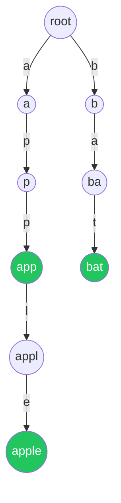

# 字典树 Trie：把"前缀匹配"做到 O(L)

## 它解决什么问题？

哈希表能 O(1) 判断"完整字符串是否存在"，但**无法回答**：

- 有多少个字符串以 `"app"` 开头？
- `"applepie"` 是不是某个已知单词的前缀？
- 给我所有以 `"hel"` 开头的候选词。

Trie 把答案做到 O(L)：



绿色节点表示"这里是一个完整单词的终点"（`is_end = true`）。

## 模板：插入、查询、前缀查询

```rust
struct Trie {
    children: [Option<Box<Trie>>; 26],
    is_end: bool,
}

impl Trie {
    fn new() -> Self {
        const NONE: Option<Box<Trie>> = None;
        Self { children: [NONE; 26], is_end: false }
    }

    fn insert(&mut self, word: &str) {
        let mut node = self;
        for c in word.bytes() {
            let i = (c - b'a') as usize;
            node = node.children[i].get_or_insert_with(|| Box::new(Trie::new()));
        }
        node.is_end = true;
    }

    fn search(&self, word: &str) -> bool {
        self.walk(word).map_or(false, |n| n.is_end)
    }

    fn starts_with(&self, prefix: &str) -> bool {
        self.walk(prefix).is_some()
    }

    fn walk(&self, s: &str) -> Option<&Trie> {
        let mut node = self;
        for c in s.bytes() {
            let i = (c - b'a') as usize;
            node = node.children[i].as_deref()?;
        }
        Some(node)
    }
}
```

`search` 和 `starts_with` 的唯一区别：前者要求终点是 `is_end == true`。

**复杂度**：插入和查询都是 O(L)，与已存单词总量无关。

## 用 HashMap 还是定长数组？

| 字符集 | 推荐 |
| --- | --- |
| 小写英文 26 | `[Option<Box<Trie>>; 26]`，最快 |
| 大小写 + 数字 | 长度 62 的数组 |
| 任意 Unicode | `HashMap<char, Box<Trie>>` |

数组节省常数但浪费空间；HashMap 灵活但常数大。竞赛优先数组，工业代码常用 HashMap。

## 例：单词搜索 II（Trie + DFS 剪枝）

> 抽象问题：在 `m × n` 字母网格里找出所有出现在词典中的单词（每次 8 联通中的 4 联通走，单词必须在格子上构成）。

朴素：对每个词跑一次 DFS → O(W · m · n · 4^L)。

**Trie 剪枝**：把所有词建一棵 Trie，然后**从每个格子出发跑一次 DFS**，同时沿着 Trie 走。一旦走到的字符不在 Trie 当前节点的孩子里，立刻剪枝。

```python
def find_words(board, words):
    root = {}
    for w in words:                                   # 建 Trie
        node = root
        for c in w:
            node = node.setdefault(c, {})
        node['$'] = w                                 # 单词终点存原词

    R, C = len(board), len(board[0])
    ans = []
    def dfs(r, c, node):
        ch = board[r][c]
        nxt = node.get(ch)
        if not nxt: return
        if '$' in nxt:
            ans.append(nxt.pop('$'))                  # 避免重复加入
        board[r][c] = '#'                             # 标记访问
        for dr, dc in [(-1,0),(1,0),(0,-1),(0,1)]:
            nr, nc = r + dr, c + dc
            if 0 <= nr < R and 0 <= nc < C and board[nr][nc] != '#':
                dfs(nr, nc, nxt)
        board[r][c] = ch                              # 回溯

    for r in range(R):
        for c in range(C):
            dfs(r, c, root)
    return ans
```

巧思：

- 找到答案后立即 `pop('$')`，防止同一个词被重复加进答案。
- 用 `board[r][c] = '#'` 原地标记走过，省去 visited 数组。

## 例：替换单词

> 抽象问题：给一组"词根"和一句话，把句子中每个单词替换成它**最短的**前缀词根。

把所有词根建 Trie，扫每个单词时沿着 Trie 走，第一次踩到 `is_end` 就截断：

```python
class TrieNode:
    def __init__(self):
        self.kids = {}
        self.word = None                              # 截断时直接返回这个根

def replace_words(roots, sentence):
    root = TrieNode()
    for r in roots:
        node = root
        for c in r:
            if c not in node.kids:
                node.kids[c] = TrieNode()
            node = node.kids[c]
        node.word = r

    def shortest(w):
        node = root
        for c in w:
            if c not in node.kids: break
            node = node.kids[c]
            if node.word: return node.word
        return w
    return ' '.join(shortest(w) for w in sentence.split())
```

## 例：最大异或对

> 抽象问题：从一个整数数组里找两个数，使它们异或值最大。

把每个数按二进制位**从高到低**插入 Trie（左孩子 0、右孩子 1）。对每个数贪心：每一位都尽量走"和自己相反"的分支，能走就走，不能就将就。

二进制 Trie 是 Trie 的"非字符串"用法，必须掌握：很多"位运算 + 极值"的题都靠这个。

## 常见坑速查

| 坑 | 修复 |
| --- | --- |
| 忘记 `is_end`，把 "app" 当 "apple" 的前缀也算成单词 | 必须区分"完整单词"和"前缀路径" |
| 用 `HashMap` 但 key 是 `char`，遍历开销大 | 字符集小时一律用数组 |
| 删除 Trie 节点时没考虑共享子树 | 先递归到叶子，再判断"无孩子且非 end"才删 |
| 用 `setdefault` / `get_or_insert_with` 写错惰性创建 | 一律先 `if not exists: create` |
| 同一个单词重复插入计数错 | 用 `count`/`is_end` 自己想清楚是布尔还是计数 |
| 输入 Unicode 也强用 `[_; 26]` | 切换到 HashMap 实现 |

## 用 Trie 还是哈希？

| 题目特征 | 选择 |
| --- | --- |
| 只判"完整存在" | 哈希表更轻 |
| 需要按前缀枚举 / 计数 | **Trie** |
| 需要"最长公共前缀"、"最短词根" | **Trie** |
| 大量插入 + 极致查询性能 | **Trie**（不哈希字符串） |
| 字符集巨大、字符串很短 | 哈希更省内存 |

## 相关题目

- #208 实现 Trie（模板）
- #211 添加与搜索单词（带 `.` 通配）
- #212 单词搜索 II（Trie + 网格 DFS）
- #648 单词替换
- #720 词典中最长的单词（DFS 走 Trie）
- #677 键值映射（带权 Trie）
- #421 数组中两个数的最大异或值（二进制 Trie）
- #1268 搜索推荐系统（前缀枚举 + 排序）
