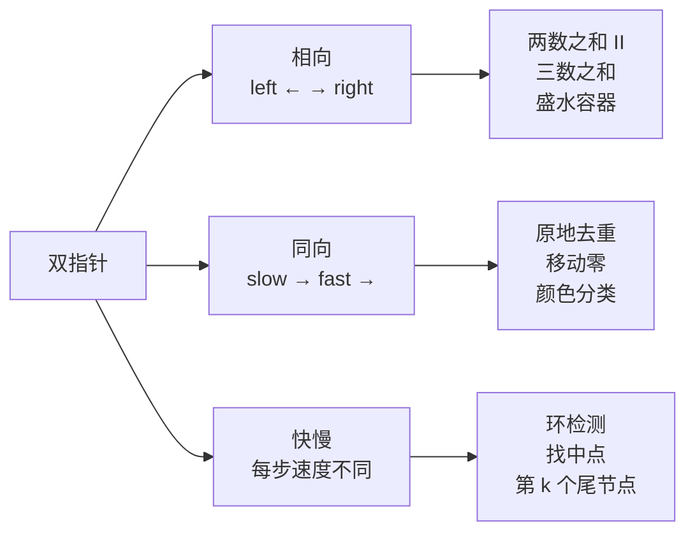
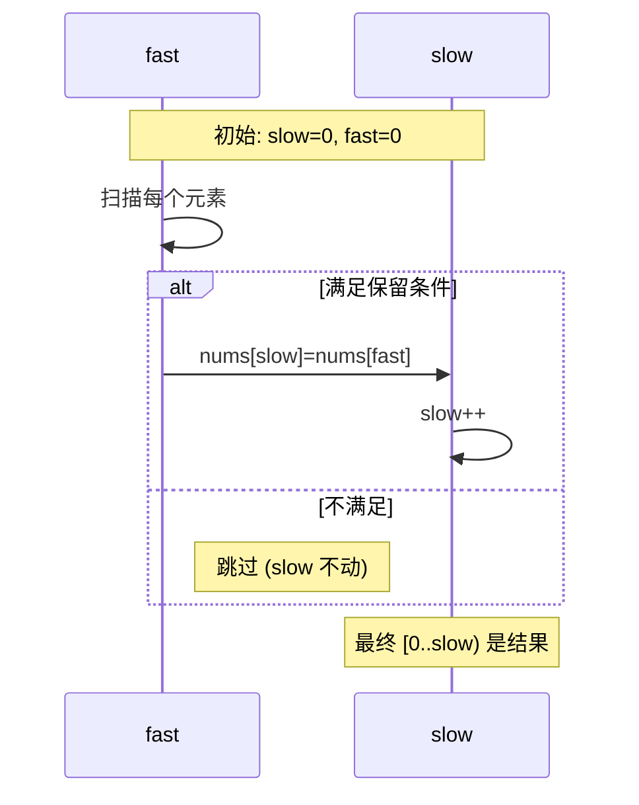
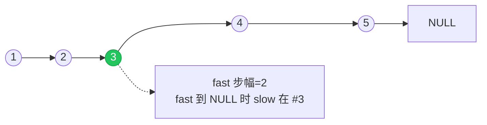

# 双指针入门：从两端逼近与快慢配对

## 一句话总结

**用两个游标在线性结构上协同移动，把原本需要嵌套循环的搜索压缩到一遍扫描。**

时间从 $O(n^2)$ 降到 $O(n)$，空间从 $O(n)$ 降到 $O(1)$，这就是双指针带来的红利。

## 三种典型形态



### 形态一：相向双指针 —— 已排序数组

**适用条件**：数组**已排序**或可以排序。

> 抽象问题：给定**升序**整数数组 `nums` 和目标值 `target`，找到两个不同下标 `(i, j)` 使 `nums[i] + nums[j] == target`。

为什么排序后能用双指针？因为有序性让我们能从两端的 `sum` 跟 `target` 的大小关系，**确定地**排除一侧候选：

- `sum < target` → 左指针必须右移（再小没意义）
- `sum > target` → 右指针必须左移
- `sum == target` → 命中

每次至少移动一格，最多 $n$ 步走完。

```rust
fn two_sum_sorted(nums: &[i32], target: i32) -> Option<(usize, usize)> {
    let (mut l, mut r) = (0, nums.len().saturating_sub(1));
    while l < r {
        let sum = nums[l] + nums[r];
        match sum.cmp(&target) {
            std::cmp::Ordering::Equal => return Some((l, r)),
            std::cmp::Ordering::Less => l += 1,
            std::cmp::Ordering::Greater => r -= 1,
        }
    }
    None
}
```

```go
func twoSumSorted(nums []int, target int) (int, int, bool) {
    l, r := 0, len(nums)-1
    for l < r {
        s := nums[l] + nums[r]
        switch {
        case s == target:
            return l, r, true
        case s < target:
            l++
        default:
            r--
        }
    }
    return 0, 0, false
}
```

```python
def two_sum_sorted(nums, target):
    l, r = 0, len(nums) - 1
    while l < r:
        s = nums[l] + nums[r]
        if s == target:
            return l, r
        if s < target:
            l += 1
        else:
            r -= 1
    return None
```

### 三数之和 —— 把"三"降成"二"

经典套路：**固定一个，剩下两数用双指针**。

```mermaid
flowchart TB
  Start[排序数组] --> Fix[外层 i 固定第一个数]
  Fix --> TP[内层 l, r 双指针]
  TP --> Check{nums[i]+nums[l]+nums[r]?}
  Check -->|==0| Hit[记录三元组<br/>l++ 并跳过重复]
  Check -->|<0| Inc[l++]
  Check -->|>0| Dec[r--]
  Hit --> TP
  Inc --> TP
  Dec --> TP
```

去重的关键：移动指针后，**跳过与刚才相同的值**，否则会重复输出。

```rust
fn three_sum(mut nums: Vec<i32>) -> Vec<Vec<i32>> {
    nums.sort_unstable();
    let n = nums.len();
    let mut out = Vec::new();
    for i in 0..n.saturating_sub(2) {
        if nums[i] > 0 { break; }                        // 后面更大,不可能凑成 0
        if i > 0 && nums[i] == nums[i - 1] { continue; } // i 去重
        let (mut l, mut r) = (i + 1, n - 1);
        while l < r {
            let s = nums[i] + nums[l] + nums[r];
            if s == 0 {
                out.push(vec![nums[i], nums[l], nums[r]]);
                l += 1; r -= 1;
                while l < r && nums[l] == nums[l - 1] { l += 1; }   // l 去重
                while l < r && nums[r] == nums[r + 1] { r -= 1; }   // r 去重
            } else if s < 0 {
                l += 1;
            } else {
                r -= 1;
            }
        }
    }
    out
}
```

### 形态二：同向双指针 —— 原地修改

**模板**：`slow` 指向"已处理完毕区域的下一位"，`fast` 一路扫描。



把"移动零"作为例子：把所有 0 移到末尾，非零元素相对顺序不变。

```rust
fn move_zeroes(nums: &mut [i32]) {
    let mut slow = 0;
    for fast in 0..nums.len() {
        if nums[fast] != 0 {
            nums.swap(slow, fast);
            slow += 1;
        }
    }
}
```

```javascript
function moveZeroes(nums) {
  let slow = 0;
  for (let fast = 0; fast < nums.length; fast++) {
    if (nums[fast] !== 0) {
      [nums[slow], nums[fast]] = [nums[fast], nums[slow]];
      slow++;
    }
  }
}
```

### 形态三：快慢指针 —— 链表场景

`slow` 走一步，`fast` 走两步。最常见的两种用途：

- **找中点**：`fast` 到尾时，`slow` 正好在中间
- **判环**：若有环，`fast` 必然在环内追上 `slow`



## 何时用 / 何时不用

| 适用 | 不适用 |
| --- | --- |
| 数组/字符串已有序，找符合关系的对 | 无序且不能排序（要求保持原顺序时） |
| 原地操作（限制 $O(1)$ 空间） | 需要回溯的搜索（用 DFS） |
| 链表的环、中点、倒数第 k 个 | 区间最值类问题（用单调队列/线段树） |

## 通用框架

```text
// 相向：
left = 0, right = n - 1
while left < right:
    根据某种条件移动 left 或 right
    如有命中则记录

// 同向：
slow = 0
for fast in 0..n:
    if 满足条件:
        nums[slow] = nums[fast]
        slow += 1

// 快慢：
slow = head, fast = head
while fast != null and fast.next != null:
    slow = slow.next
    fast = fast.next.next
```

## 相关题目

- #1 两数之和（无序版本要用哈希）
- #167 两数之和 II（已排序，相向）
- #15 三数之和（固定一个 + 相向）
- #11 盛最多水的容器（贪心 + 相向）
- #26 删除有序数组中的重复项（同向）
- #283 移动零（同向）
- #75 颜色分类（三指针变体）
- #88 合并两个有序数组（从后往前的同向）

---

> 练习时先进入对应题目详情页，隐藏题解后自己写一遍，再展开代码对照。
