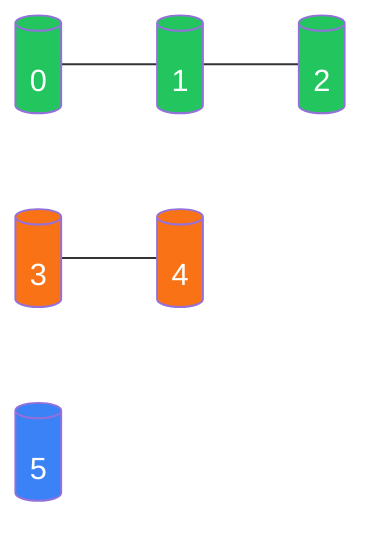

# 并查集：连通性问题的"刀片"模板

## 什么时候用？

只要题目里有"**判断两点是否连通**"或"**统计连通块数量**"，先想并查集。具体信号：

- 一堆边动态加入，问最后有几个连通分量。
- 加边过程中，某条边是否会形成环（最小生成树 Kruskal）。
- 等式约束求一致性（如 "a == b, b != c"）。
- 二维网格里数岛屿、感染区域。



每个连通块用一个**代表元**（树根）代表，"查连通"就是"看两个点的根是不是同一个"。

## 三件套：parent + 路径压缩 + 按秩合并

```rust
struct DSU {
    parent: Vec<usize>,
    rank: Vec<u32>,
    count: usize,                                    // 当前连通块数
}

impl DSU {
    fn new(n: usize) -> Self {
        Self {
            parent: (0..n).collect(),                // 自环, 每个点自己是根
            rank: vec![0; n],
            count: n,
        }
    }

    fn find(&mut self, x: usize) -> usize {
        if self.parent[x] != x {
            self.parent[x] = self.find(self.parent[x]);   // 路径压缩
        }
        self.parent[x]
    }

    fn union(&mut self, x: usize, y: usize) -> bool {
        let (rx, ry) = (self.find(x), self.find(y));
        if rx == ry { return false; }                // 已经连通
        // 按秩合并: 矮的挂到高的下面
        if self.rank[rx] < self.rank[ry] {
            self.parent[rx] = ry;
        } else if self.rank[rx] > self.rank[ry] {
            self.parent[ry] = rx;
        } else {
            self.parent[ry] = rx;
            self.rank[rx] += 1;
        }
        self.count -= 1;
        true
    }

    fn connected(&mut self, x: usize, y: usize) -> bool {
        self.find(x) == self.find(y)
    }
}
```

两项优化都开后，find/union 摊还复杂度是 $\alpha(n)$（反阿克曼函数），实际可以当作 O(1)。

**只压缩、不按秩**也可以，常数大一点点，但写起来短。竞赛里两个都开。

## 例 1：省份数量

> 抽象问题：`isConnected[i][j] == 1` 表示城市 i 和 j 相邻，统计有多少个**省份**（连通块）。

并查集逐边合并，最后看 `count`：

```rust
fn find_circle_num(is_connected: Vec<Vec<i32>>) -> i32 {
    let n = is_connected.len();
    let mut dsu = DSU::new(n);
    for i in 0..n {
        for j in (i + 1)..n {
            if is_connected[i][j] == 1 {
                dsu.union(i, j);
            }
        }
    }
    dsu.count as i32
}
```

这种题 DFS / BFS 也能做，但并查集的优势是**支持动态加边**。

## 例 2：冗余连接（找环上的最后一条边）

> 抽象问题：给一棵原本是树的图，多了一条边形成环。返回**输入顺序中最后一条**导致成环的边。

逐条边 union：如果 `union` 返回 `false`（已经连通），说明这条边就是答案。

```python
def find_redundant_connection(edges):
    n = len(edges)
    p = list(range(n + 1))
    def find(x):
        while p[x] != x:
            p[x] = p[p[x]]                          # 简化路径压缩
            x = p[x]
        return x
    for u, v in edges:
        ru, rv = find(u), find(v)
        if ru == rv:
            return [u, v]
        p[ru] = rv
```

模板基本不动，**问题翻译成"哪条边让两个已连通的点又连了一次"** 就完事。

## 例 3：最小生成树 Kruskal

并查集是 Kruskal 算法的核心：

1. 边按权重升序排。
2. 依次尝试加入：若两端尚未连通就 union 进答案集合。
3. 收集到 `n - 1` 条边就停。

```text
sort(edges, by weight ascending)
ans = 0
for (u, v, w) in edges:
    if dsu.union(u, v):
        ans += w
return ans
```

## 例 4：带权并查集 / 等式约束

> 抽象问题：方程 `a == b`、`a != b` 的集合是否一致？

把每个变量当节点，对所有 `==` 关系 union 在一起。然后扫所有 `!=` 关系：如果两端属于同一个集合，矛盾。

带权版本（如"等式 a / b = k"）需要 `find` 时把"到父节点的边权"也压缩并维护好。这是并查集的进阶用法，不是常考点，但出过的题（如"除法求值"）必须会。

## 二维网格：坐标 → 编号

> 抽象问题：岛屿数量。`grid[i][j]` 是 '1' 表示陆地，求四联通岛屿数。

把 `(i, j)` 映射成一个整数 `i * cols + j`，然后对所有相邻陆地 union。也可以加一个虚拟"水"节点统一处理。但更常见还是 DFS / BFS——**只有当题目要求动态加陆地或动态查询时**，并查集才比 DFS 更优。

代表题：**Number of Islands II**（动态加陆地）。

## 常见坑速查

| 坑 | 修复 |
| --- | --- |
| 忘记初始化 `parent[i] = i` | 用工厂方法 `DSU::new(n)` 包装 |
| 路径压缩漏写：`return parent[x]`（没赋回去） | 一定要写 `parent[x] = find(parent[x])` |
| `union` 没判已连通就 count-- | 先比较根再减计数 |
| 节点编号从 0 还是 1 | 看清题目，必要时多开一格 |
| 二维坐标编号公式写错 | `idx = i * cols + j`，cols 别拿成 rows |
| 带权并查集忘记压缩时维护权 | 写 `find` 时同步把权重叠加上去 |

## 用 DSU 还是 DFS？

| 题目特征 | 优选 |
| --- | --- |
| 一次性建图 + 静态查询 | DFS / BFS |
| 动态加边、加点 | **并查集** |
| 同时要"连通块大小" | 并查集（额外维护 `size[root]`） |
| 求最小生成树 | 并查集（Kruskal） |
| 二分答案验证连通性 | 并查集（每次重新建） |

## 相关题目

- #547 省份数量（计数模板）
- #200 岛屿数量（DFS 优先，DSU 也行）
- #684 冗余连接（找成环的边）
- #128 最长连续序列（DSU 变种 / 哈希更优）
- #952 按公因数计算最大组件大小
- #990 等式方程的可满足性
- #1319 连通网络的操作次数
- #1971 寻找图中是否存在路径（基本应用）
- #130 Surrounded Regions（虚拟节点技巧）
